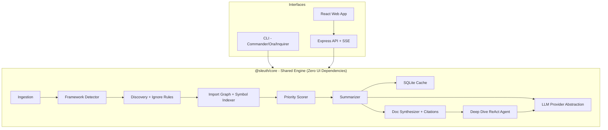
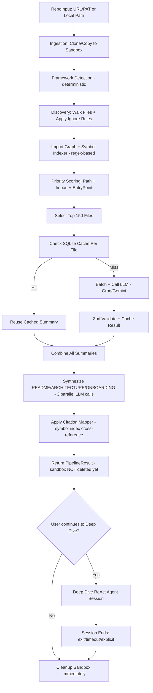

# Sleuth — System Architecture & Technical Specification

---

## 1. High-Level System Diagram



---

## 2. Shared Core Engine Isolation Principle

`@sleuth/core` is a pure TypeScript library with zero UI or transport dependencies. It must never import from `express`, `react`, `commander`, or any presentation-layer package.

**Dependency Rule (Strictly Enforced):**

```text
@sleuth/cli  ──depends on──▶  @sleuth/core
@sleuth/api  ──depends on──▶  @sleuth/core
@sleuth/web  ──depends on──▶  @sleuth/api (never core directly)

@sleuth/core ──depends on──▶  NOTHING presentation-related
```

This guarantees: any business logic bug fix or feature addition happens in exactly one place, and both interfaces stay perfectly in sync by construction, not by discipline.

---

## 3. Exact Modular Directory Tree

```text
sleuth/
├── package.json                          # npm workspaces root
├── tsconfig.base.json
├── .env.example
├── CLAUDE.md
├── PRD.md
├── ARCHITECTURE.md
├── prompts.md                            # AI prompt execution log (see CLAUDE.md)
│
├── packages/
│   ├── core/                             # @sleuth/core
│   │   ├── package.json
│   │   ├── tsconfig.json
│   │   └── src/
│   │       ├── types.ts                  # Shared TS interfaces
│   │       ├── schemas.ts                # Zod schemas (validation layer)
│   │       ├── pipeline.ts               # Orchestrator — wires all stages
│   │       │
│   │       ├── security/
│   │       │   ├── path-guard.ts         # assertSafePath()
│   │       │   └── sanitize.ts           # sanitizeForLLM(), redactSecrets()
│   │       │
│   │       ├── ingestion/
│   │       │   ├── sandbox-manager.ts    # temp dir create/cleanup
│   │       │   ├── clone.ts              # git clone (public + PAT)
│   │       │   └── local.ts              # local folder ingestion
│   │       │
│   │       ├── analysis/
│   │       │   ├── framework-detector.ts # deterministic, no LLM
│   │       │   ├── discovery.ts          # file walk + ignore rules
│   │       │   ├── import-graph.ts       # regex-based import resolution
│   │       │   ├── symbol-indexer.ts     # regex-based symbol/line extraction
│   │       │   └── prioritizer.ts        # scoring engine
│   │       │
│   │       ├── cache/
│   │       │   └── sqlite-cache.ts       # better-sqlite3 wrapper
│   │       │
│   │       ├── llm/
│   │       │   ├── provider.ts           # Groq + Gemini fallback chain
│   │       │   └── rate-limiter.ts       # token bucket
│   │       │
│   │       ├── documentation/
│   │       │   ├── summarizer.ts         # batched LLM summarization
│   │       │   ├── citation-mapper.ts    # symbol → [file:line] mapping
│   │       │   └── synthesizer.ts        # README/ARCHITECTURE/ONBOARDING
│   │       │
│   │       ├── agent/
│   │       │   ├── tools.ts              # 5 agent tools
│   │       │   ├── prompts.ts            # planning/reasoning/synthesis templates
│   │       │   ├── investigator.ts       # ReAct loop
│   │       │   └── session.ts            # session lifecycle + visited cache
│   │       │
│   │       ├── utils/
│   │       │   └── json-repair.ts        # malformed LLM JSON recovery
│   │       │
│   │       └── __tests__/                # mirrors src/ structure
│   │
│   ├── cli/                              # @sleuth/cli
│   │   ├── package.json
│   │   └── src/
│   │       ├── index.ts                  # commander entrypoint
│   │       ├── analyze.ts                # `sleuth analyze` command
│   │       └── ask.ts                    # `sleuth ask` REPL
│   │
│   ├── api/                              # @sleuth/api
│   │   ├── package.json
│   │   └── src/
│   │       ├── index.ts                  # Express app + middleware
│   │       ├── routes/
│   │       │   ├── analyze.ts            # POST /api/analyze, status, results, download
│   │       │   └── sessions.ts           # session start/ask/end + SSE stream
│   │       └── session-reaper.ts         # idle-timeout cleanup job
│   │
│   └── web/                              # @sleuth/web
│       ├── package.json
│       └── src/
│           ├── pages/
│           │   ├── LandingPage.tsx
│           │   ├── AnalysisPage.tsx
│           │   └── ResultsPage.tsx
│           ├── components/
│           │   ├── ProgressStepper.tsx
│           │   ├── MarkdownViewer.tsx
│           │   ├── FileTree.tsx
│           │   └── DeepDivePanel.tsx
│           ├── hooks/
│           │   └── useAnalysis.ts
│           └── api.ts
```

---

## 4. Priority Scoring Formula — Complete Mechanics

```text
PriorityScore(file) = PathScore(file) + ImportScore(file) + EntryPointBonus(file)
```

### 4.1 PathScore — Tiered Lookup Table

| Tier | Score | Pattern Examples |
|---|---|---|
| 1 — Critical Anchors | 100 | `package.json`, `server\|app\|main\|index.(ts\|js)`, `src/main.tsx` |
| 2 — Config & Docs | 85 | `README.md`, `tsconfig.json`, `vite.config.*`, `next.config.*` |
| 3 — Backend/Frontend Core | 70 | `routes/`, `controllers/`, `services/`, `middleware/`, `auth/`, `config/`, `database/`, `models/`, `app/`, `pages/`, `layouts/`, `store/`, `api/` |
| 4 — Supporting Structure | 55 | `components/`, `hooks/`, `context/`, `shared/`, `lib/` |
| 5 — Shared Tooling | 40 | `docker*`, `.eslintrc*`, `prettier*`, `.github/workflows/`, `turbo.json`, `nx.json` |
| Baseline | 20 | Any unmatched source file |

### 4.2 ImportScore — Regex-Based Import Graph

```text
ImportScore(file) = min(inDegree(file) × 4, 40)
```

Where `inDegree(file)` = count of other analyzed files that import it via a relative path (`./`, `../`). Bare specifiers and path aliases (`@/utils`) are not resolved in MVP (documented limitation — see Section 8).

### 4.3 EntryPointBonus — Signature-Based (Not Filename-Based)

```text
EntryPointBonus(file) = 30 if file contains a runtime bootstrap signature, else 0
```

Signatures checked: `app.listen(`, `createServer(`, `ReactDOM.createRoot(`, `ReactDOM.render(`, `NestFactory.create(`

Rationale: Filenames like `index.ts` are ambiguous and appear dozens of times in a typical repo. Detecting the actual bootstrap call is unambiguous and deterministic.

### 4.4 Selection

```text
prioritized = allFiles
  .map(f => ({ ...f, score: PathScore(f) + ImportScore(f) + EntryPointBonus(f) }))
  .sort(descending by score)
  .slice(0, MAX_ANALYZE)   // default 150, configurable via --max-files
```

---

## 5. SQLite Cache Schema

```sql
CREATE TABLE IF NOT EXISTS summaries (
  cache_key      TEXT PRIMARY KEY,   -- sha256(repoId + commitHash + path + contentHash + promptVersion)
  file_path      TEXT NOT NULL,
  content_hash   TEXT NOT NULL,      -- sha256 of raw file content
  summary_json   TEXT NOT NULL,      -- serialized FileSummary
  created_at     INTEGER NOT NULL    -- epoch ms, for 7-day TTL eviction
);

CREATE INDEX IF NOT EXISTS idx_file_path ON summaries(file_path);
```

**Cleanup triggers:**

- Row expires (logically) after 7 days — checked at read-time, not via a cron job (`get()` returns `null` if `Date.now() - created_at > TTL`)
- No automatic `DELETE` sweep needed for MVP — expired rows are simply ignored and overwritten on next write to the same `cache_key`
- Entire `.sqlite` file may be safely deleted at any time — it is a cache, never a source of truth

**Deep Dive Visited-File Cache (Separate, In-Memory Only):**

```typescript
// Session-scoped, NOT persisted to SQLite, NOT shared across sessions
visitedFiles: Map<string /* path */, string /* content */>
```

---

## 6. Shared TypeScript Interfaces & Zod Schemas

```typescript
// packages/core/src/types.ts

export interface RepoInput {
  type: 'local' | 'github';
  path?: string;
  url?: string;
  pat?: string; // never persisted beyond request scope
}

export interface RepoMeta {
  name: string;
  identifier: string;
  commitHash: string;
  rootPath: string;
  frameworks: string[];
  isMonorepo: boolean;
  workspaceDirs: string[];
  packageManager: 'npm' | 'yarn' | 'pnpm';
}

export interface FileNode {
  path: string;
  type: 'file' | 'directory';
  size: number;
  score?: number;
}

export interface Symbol {
  name: string;
  type: 'function' | 'class' | 'export' | 'const';
  line: number;
}

export interface FileSummary {
  path: string;
  purpose: string;
  exports: string[];
  dependencies: string[];
  summary: string;
}

export interface SynthesisResult {
  readme: string;
  architecture: string;
  onboarding: string;
}

export interface AuditEntry {
  timestamp: number;
  stage: string;
  action: string;
  detail: string;
}

export interface AgentDecision {
  thought: string;
  action: 'tool_call' | 'finish';
  toolName?: string;
  toolArgs?: Record<string, unknown>;
}

export interface DeepDiveSession {
  sessionId: string;
  repoMeta: RepoMeta;
  sandboxPath: string;
  summariesMap: Map<string, FileSummary>;
  visitedFiles: Map<string, string>;
  createdAt: number;
  lastActivityAt: number;
}

export interface InvestigationResult {
  question: string;
  answer: string;
  plan: string;
  iterations: number;
  filesExamined: string[];
  reasoningTrace: Array<{
    thought: string;
    toolName: string;
    toolArgs: Record<string, unknown>;
    observation: string;
  }>;
}
```

```typescript
// packages/core/src/schemas.ts
import { z } from 'zod';

export const FileSummarySchema = z.object({
  path: z.string(),
  purpose: z.string().max(500),
  exports: z.array(z.string().max(100)).max(50),
  dependencies: z.array(z.string().max(100)).max(50),
  summary: z.string().max(1000),
});

export const AgentDecisionSchema = z.object({
  thought: z.string(),
  action: z.enum(['tool_call', 'finish']),
  toolName: z.string().optional(),
  toolArgs: z.record(z.unknown()).optional(),
});

export const ToolArgsSchemas = {
  read_file: z.object({ path: z.string() }),
  search_code: z.object({ query: z.string(), maxResults: z.number().default(20) }),
  list_directory: z.object({ path: z.string() }),
  get_file_summary: z.object({ path: z.string() }),
  find_references: z.object({ symbol: z.string() }),
};

export const RepoInputSchema = z.object({
  type: z.enum(['local', 'github']),
  path: z.string().optional(),
  url: z.string().regex(/^https:\/\/github\.com\/[\w.\-]+\/[\w.\-]+(\.git)?$/).optional(),
  pat: z.string().optional(),
}).refine(d => d.type === 'local' ? !!d.path : !!d.url, {
  message: 'path required for local, url required for github',
});
```

---

## 7. Ingestion → Documentation Pipeline Flow



---

## 8. Documented MVP Limitations

| Limitation | Rationale |
|---|---|
| Regex-based import/symbol extraction, not full AST | Avoids heavyweight parser dependency; ~95% signal for ~5% of the engineering cost |
| Path aliases (`@/utils`) not resolved in import graph | Requires parsing tsconfig/webpack/vite alias configs — deferred to v2 |
| Monorepo detection biases scoring but doesn't trigger per-package pipelines | Avoids multiplying pipeline runs/UI complexity in MVP |
| In-memory run/session state (no DB persistence) | Acceptable for single-instance MVP; horizontal scaling is a v2 concern |