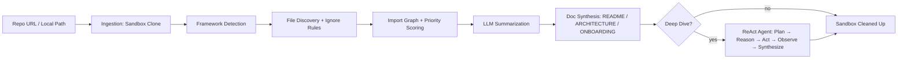

# Sleuth 🕵️

### The Autonomous Codebase Detective

> Point Sleuth at a repository. Walk away with three citation-backed documents and an AI you can actually interrogate — "How does auth work here?", "Trace the request lifecycle" — answered from the real code, not a guess.

[](https://www.npmjs.com/package/sleuth-cli)


---

## Table of Contents

- [The Problem](#the-problem)
- [The Solution](#the-solution)
- [Project Status](#project-status)
- [Installation](#installation)
- [Quick Start](#quick-start)
- [Commands](#commands)
- [How It Works](#how-it-works)
- [AI / LLM Usage](#ai--llm-usage)
- [Limitations](#limitations)
- [Security](#security)
- [Project Structure](#project-structure)
- [Contributing](#contributing)

---

## The Problem

Opening an unfamiliar codebase is one of the most consistently slow, consistently under-tooled moments in software engineering. Whether it's a developer picking up an old side project, a CS student trying to learn from a real-world repository, or a new hire on a small team with no one free to walk them through it — the answer is almost always the same: read the code, file by file, and build a mental model by hand. That can take hours. Sometimes days.

Existing tools either point you at a vector database and a semantic search box, or assume you have an enterprise budget and a platform team. Neither fits the person who just wants to understand _this one repo_, right now, for free.

## The Solution

Sleuth is a **local-first** tool that ingests a GitHub repository (public or private) or a local folder and produces two things:

1. **Three generated documents** — `README`, `ARCHITECTURE`, and `ONBOARDING` — built from a deterministic analysis pipeline (framework detection, import graph, priority scoring) with every architectural claim backed by a real `[file:line]` citation, not an LLM guess.
2. **An interactive investigator ("Deep Dive")** — a bounded, tool-using ReAct agent you can ask open-ended questions, which reads the actual source and cites what it finds.

The design philosophy is deliberately narrow: **determinism where possible, LLM only where necessary.** Framework detection, ignore rules, priority scoring, and the import graph are 100% deterministic, regex-based, zero-LLM-call code. The two documentation-generation stages and the Deep Dive agent are the only places an LLM is involved — and every one of those calls has a Zod-validated exit path and a deterministic fallback, so no single LLM hiccup ever silently corrupts the output. All of it runs on **free-tier LLM providers**, with no vector database, no embeddings, and no infrastructure to stand up.

## Project Status

Sleuth is an active MVP build. The CLI is complete and published; the web app is functional end-to-end for analysis and document viewing, with its live chat interface still in progress.

| Component        | Status                                                                                                                                                                  |
| ---------------- | ----------------------------------------------------------------------------------------------------------------------------------------------------------------------- |
| **`sleuth-cli`** | ✅ **MVP shipped** — published to npm, this is the primary, first-class interface today                                                                                 |
| **Core engine**  | ✅ Complete — the shared analysis pipeline, Deep Dive agent, and LLM provider chain both interfaces run on                                                              |
| **API server**   | 🚧 **In development** — Express + SSE backend for the web app                                                                                                           |
| **Web app**      | 🚧 **In development** — repository submission, live progress, and the tabbed document viewer are working; the real-time Deep Dive chat interface is the remaining piece |

Until the web app's chat interface lands, **the CLI is the recommended way to use Sleuth**, including for Deep Dive investigations.

## Installation

```bash
npm install -g sleuth-cli
```

Requires **Node.js 20 or newer**. See the [`sleuth-cli` package README](packages/cli/README.md) for the published package's own docs.

To work on Sleuth itself (contribute, run the web app, etc.), clone the monorepo instead:

```bash
git clone https://github.com/IbrahimHamid2002/sleuth.git
cd sleuth
npm install
npm run build
```

## Quick Start

```bash
# Analyze a public GitHub repo (writes 3 Markdown files to the current directory)
sleuth analyze https://github.com/some-org/some-repo

# Or analyze a local folder
sleuth analyze ./path/to/local/project

# Ask a question about the repo you just analyzed
sleuth ask "How does authentication work?"
```

`sleuth analyze` writes three files to the current working directory (or `--output`, if given): `README.generated.md`, `ARCHITECTURE.md`, and `ONBOARDING.md`.

## Commands

### `sleuth analyze <target>`

| Flag              | Description                                                                                                 |
| ----------------- | ----------------------------------------------------------------------------------------------------------- |
| `--token <pat>`   | GitHub Personal Access Token, for analyzing private repositories                                            |
| `--max-files <n>` | Maximum number of files to analyze (default: 150 — see [Limitations](#limitations))                         |
| `--output <dir>`  | Output directory for the generated Markdown files (defaults to the current working directory)               |
| `--resume`        | Confirms/reports whether this run resumed from a previous interrupted run — caching is always on regardless |

### `sleuth ask [question]`

Asks a question about the most recently analyzed repository, reusing its sandbox without re-cloning. Pass a `question` to ask once and exit, or omit it for an interactive REPL — type `exit`, `quit`, `bye`, or `goodbye` to end the session and clean up.

### `sleuth config`

Manages persisted API keys at `~/.sleuth/config.json` via `set <key> <value>`, `list`, and `clear`. Keys are never transmitted anywhere except directly to the LLM provider they belong to.

## How It Works



Everything up to and including priority scoring is deterministic — zero LLM calls. Only the highest-priority files (see [Limitations](#limitations)) get sent to an LLM for summarization, and the three documents are synthesized from those summaries via three independent LLM calls, so one failure never blocks the others.

**Deep Dive agent:** a ReAct-style loop — Plan → Reason → Act (via tools) → Observe → Reflect → Synthesize — with six tools (`search_docs`, `read_file`, `search_code`, `list_directory`, `get_file_summary`, `find_references`), preferring pre-generated docs and summaries over reading raw source whenever they're sufficient. Bounded to 6 reasoning iterations, with a 60-second timeout per step.

This is a simplified summary — see [ARCHITECTURE.md](ARCHITECTURE.md) for the full technical specification and [PRD.md](PRD.md) for the complete product requirements.

## AI / LLM Usage

Sleuth uses three LLM providers, all on **free tiers** — bring your own free API keys, Sleuth never bundles or shares one:

| Provider                                              | Role                                                                | Get a free key |
| ----------------------------------------------------- | ------------------------------------------------------------------- | -------------- |
| [Groq](https://console.groq.com/keys)                 | Primary — documentation pipeline **and** Deep Dive agent            | Free           |
| [OpenRouter](https://openrouter.ai/keys)              | Secondary fallback — documentation pipeline **and** Deep Dive agent | Free           |
| [Google Gemini](https://aistudio.google.com/api-keys) | Final fallback — **documentation pipeline only**                    | Free           |

The Deep Dive agent's chain is deliberately **Groq → OpenRouter only** (no Gemini fallback): on a live, user-facing question-answering path, a stalled or blank-looking answer is worse than a clear, visible error, so if both fail, the agent surfaces an explicit error instead of degrading further.

Run `sleuth analyze` or `sleuth ask` with no keys configured and you'll be prompted interactively; keys are saved to `~/.sleuth/config.json` for future runs, or you can export any of them as real environment variables instead.

**Privacy:** a GitHub PAT is never logged, written to disk, or sent to any LLM — it lives only in memory for the clone step. No repository content is ever permanently stored; the only persistent cache is a small SQLite file of content hashes and short JSON summaries, never raw source.

## Limitations

Sleuth is intentionally scoped for speed and reliability over completeness:

- **Repository size:** designed for repositories up to **~1000 analyzable files** (hard discovery cap: **1500 files**). Of those, only the top **150 files by default** (configurable via `--max-files`) are actually sent to an LLM for summarization — selected by a deterministic priority score, so the files most likely to matter architecturally are the ones covered.
- **Regex-based analysis, not a full AST parser.** Import and symbol extraction use pattern matching rather than a real TypeScript/JavaScript parser — fast and dependency-light, but it can miss unusual syntax a full parser would catch.
- **Path aliases aren't resolved.** Imports like `@/utils/foo` aren't traced in the import graph — only relative imports (`./`, `../`) are.
- **Monorepo-aware, but single-pipeline.** Monorepo/multi-package structure is detected and factored into scoring, but one analysis pass covers the whole repository rather than a pipeline per package.
- **No git history analysis.** Sleuth explains the current snapshot of a repository, not how it evolved.
- **Single-process, local execution only.** No distributed processing.

See [ARCHITECTURE.md](ARCHITECTURE.md#8-documented-mvp-limitations) for the complete, technical limitations table.

## Security

- **Ephemeral, isolated clones** — every analysis clones into its own temporary sandbox, deleted on pipeline completion, Deep Dive session exit, or idle timeout (web app).
- **PAT handling** — used only in-memory for the clone step, never logged, never written to disk, never sent to an LLM.
- **Local-only processing** — all analysis and LLM calls go directly from your machine to the provider you configured; there is no Sleuth-operated backend for the CLI.
- **No telemetry** — Sleuth does not collect or transmit usage analytics.

See [PRD.md](PRD.md#5-security--data-handling-specifications) for the full security specification.

## Project Structure

An npm-workspaces monorepo with one shared engine and three interfaces on top of it:

```
sleuth/
├── packages/
│   ├── core/     # @sleuth/core   — the shared, UI-free analysis engine + Deep Dive agent
│   ├── cli/      # sleuth-cli     — published npm package, the primary interface (MVP)
│   ├── api/      # @sleuth/api    — Express + SSE backend for the web app
│   └── web/      # @sleuth/web    — React web app (in development)
├── PRD.md            # Product requirements
├── ARCHITECTURE.md   # Technical specification
└── CLAUDE.md         # AI-assisted engineering guidelines for this repo
```

`core` never imports anything presentation-related (`express`, `react`, `commander`) — both `cli` and `api` call the exact same engine functions, so a fix or feature in `core` reaches every interface at once. See [ARCHITECTURE.md](ARCHITECTURE.md#2-shared-core-engine-isolation-principle) for the full dependency rule.

## Contributing

Issues and pull requests are welcome on the [GitHub repository](https://github.com/IbrahimHamid2002/sleuth). This project was built with Claude Code as an AI pair-programming assistant under a documented set of engineering guidelines — see [CLAUDE.md](CLAUDE.md) — and every prompt used to build it is logged verbatim in [prompts.md](prompts.md).
